# Security Policy

Due to the nature of what we are doing, fwupd takes security very seriously.
If you have any concerns please let us know.

## Supported Versions

The `main`, and `1.8.x`, branches are fully supported by the upstream authors
with all unstable code belonging in `wip` branches.
Additionally, the `1.6.x` and `1.7.x` branches are supported for security fixes.

| Version | Supported          |
| ------- | ------------------ |
| 1.9.x   | :heavy_check_mark: |
| 1.8.x   | :heavy_check_mark: |
| 1.7.x   | :white_check_mark: |
| 1.6.x   | :white_check_mark: |
| 1.5.x   | :x: EOL 2022-01-01 |
| 1.4.x   | :x: EOL 2021-05-01 |
| 1.3.x   | :x: EOL 2020-07-01 |
| 1.2.x   | :x: EOL 2019-12-01 |
| 1.1.x   | :x: EOL 2018-11-01 |
| 1.0.x   | :x: EOL 2018-10-01 |
| 0.9.x   | :x: EOL 2018-02-01 |

Older releases than this are unsupported by upstream but may be supported by
your distributor or distribution. If you open an issue with one of these older
releases the very first question from us is going to be asking if it's fixed on
a supported branch. You can use the flatpak or snap packages if your distributor
is unwilling to update to a supported version.

## Reporting a Vulnerability

If you find a vulnerability in fwupd your first thing you should do is email
all the maintainers, which are currently listed in the `MAINTAINERS` file in
this repository.

Failing that, please report the issue against the `fwupd` component in Red Hat
bugzilla, with the security checkbox set. You should get a response within 3
days. We have no bug bounty program, but we're happy to credit you in updates
if this is what you would like us to do.

## Threat Modeling

### Who We Trust

In this diagram, the arrow shows the flow of *information* from one entity to another.

Important things to note:

* OEMs and ODMs have to apply for a LVFS account and the website and email domain is verified
* OEMs and ODMs can only upload for devices that match their device-supplied vendor-id
* The relationship between the OEM/ODM and affiliate ISV/IBV is implemented using per-task ACLs
* The LVFS is assumed to be managed by a vendor-neutral trusted team
* Signing of the metadata and firmware is implemented using PKCS#7 and GPG
* End users only trust the LVFS signing signatures by default
* Metadata contains SHA-1 and SHA-256 hashes of the firmware archive
* Access to the embargo remotes requires knowing the secret vendor hash, but not a token
* The firmware archive internal metadata and firmware payload are both signed
* Reports have to be signed by the user machine key to be attributable to an OEM or QA team
* Signed reports are uploaded using a username and access token
* SBoM metadata is extracted from the payload by the LVFS and formatted into HTML/SWID formats
* Security researchers can only run FwHunt/Yara scans on public firmware

```mermaid
  flowchart TD
      LVFS((LVFS Webservice)) -- "SBoM.html" --> User(End User)
      LVFS -- "md.[xml|jcat] 🔒" --> CDN(Fastly CDN)
      CDN -- "md.[xml|jcat] 🔒" --> User
      LVFS -- "embargo.[xml|jcat] 🔒" --> User
      LVFS -- "fw.cab 🔒" --> User
      User -. report.json .-> LVFS
      User -. hsi.json .-> LVFS
      QA(QA Teams) -- "report.json 🔒" --> LVFS
      OEM(Device Vendor) -- "fw.cab" --> LVFS
      ODM(Device Manufacturer) -- "fw.[bin|cab]" --> OEM
      OEM -. "report.json 🔒" .-> LVFS
      ODM -. "fw.cab" .-> LVFS
      IBV(BIOS Vendor) -- "fw.bin" --> ODM
      ISV(Silicon Vendor) -- "fw.bin" --> ODM
      LVFS -- "FwHunt|Yara" --> SecAlert(Security Researchers)
```

### What We Trust

In this diagram, the arrow shows the flow of *data* between different processes or machines.

Important things to note:

* User-facing clients like `fwupdmgr` and `gnome-software` should not be run as the root user
* The fwupd daemon should be run as a privileged user and have no access to the network
* Privilege escalation is performed using PolicyKit based on fine-grained ACLs, if available
* Passwords may be in plaintext in `remotes.d` or config files, and should be readable only by root
* The fwupd daemon will only install firmware archives signed by the LVFS unless modified
* The fwupd daemon scans and verifies the mtime of various files at startup to build caches
* If SecureBoot is turned on then `fwupd-efi` has to be signed by a trusted key
* Files are passed between the user client and fwupd using an open file-descriptor, not a filename
* There is no public interface to either the PostgreSQL or EFS data stores
* The fwupd daemon may need to mount the EFI system partition to copy in capsule payloads
* The `fwupdtool` debug tool requires root access to perform updates on devices

```mermaid
  flowchart TD
      subgraph Vendor
        OEM(OEM/ODM/ISV Firmware)
      end
      subgraph User
        fwupdmgr((fwupdmgr\ngnome-software))
      end
      subgraph Privileged
        fwupd((fwupd\ndaemon))
        fwupdengine(FuEngine)
        fwupdtool(fwupdtool\ndebug\ntool)
        fwupd-efi(fwupd capsule loader)
        Pending[(history.db)]
        Kernel((OS Kernel))
        ESP[(EFI\nSystem\nPartition)]
        SPI[(System SPI)]
        UsbDevice(USB Device)
        UsbDeviceEEPROM[(USB Device\nEEPROM)]
        State[(/var/lib/fwupd)]
        NVRAM[(Non-volatile\nRAM)]
      end
      subgraph Internet
        LVFS((LVFS\nInstance))
        CDN(Fastly\nCDN)
        EFS[(Amazon\nEFS)]
        Postgres[(Amazon\nRDS)]
        Worker(Async Workers)
      end
      LVFS -- "fw.cab" --> Worker
      Worker -- "md.xml 🔒" --> EFS
      EFS <-- "fw.cab 🔒" --> Worker
      OEM -- "firmware.cab" --> LVFS
      LVFS -. "report.html" .-> OEM
      EFS <--> LVFS
      Postgres <--> Worker
      Postgres <--> LVFS
      fwupd <--> fwupdengine
      fwupdengine <-- "sqlite" --> Pending
      UsbDevice <-- "i²c" --> UsbDeviceEEPROM
      fwupdengine <-- "libusb" --> UsbDevice
      fwupdtool <---> fwupdengine
      fwupdengine <-- "ioctl()\nread()\nwrite()" --> Kernel
      fwupdengine -. "fwupdx64.efi" .-> ESP
      fwupdengine -- "fw.bin" --> ESP
      fwupdengine -- "fw.bin" --> Kernel
      fwupdengine -- "efivar" ---> Kernel
      Kernel -. "HSI attrs" .-> fwupdengine
      Kernel <-- "efivars" --> NVRAM
      fwupd-efi -- "fw.cap 🔏" ---> SPI
      fwupd-efi <-- "efivars" --> NVRAM
      ESP --> fwupd-efi
      fwupdmgr -- "md.[xml|jcat] 🔒🚏" --> fwupd
      fwupd -- "Devices\nHSI attrs\nReleases 🚏" --> fwupdmgr
      fwupdmgr -- "fw.cab 🔒🚏" --> fwupd
      CDN -- "md.[xml|jcat] 🔒" --> fwupdmgr
      LVFS -- "md.[xml|jcat] 🔒" --> CDN
      LVFS -- "fw.cab 🔒" --> fwupdmgr
      LVFS -- "embargo.[xml|jcat] 🔒" --> fwupdmgr
      fwupdmgr -. "report.json" .-> LVFS
      fwupdmgr -. "report.json 🔒" .-> LVFS
      State <-- "fw.cab 🔒" --> fwupd
      User ~~~~ Privileged
      Internet ~~~~~ User
      Vendor ~~~~~ Internet
```



### Key

* 🚏: D-Bus
* 🔒: Signed using JCat file
* 🔏: Signed using Platform Key
