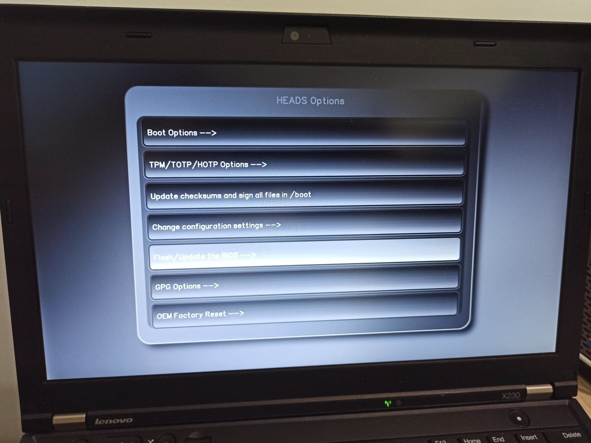
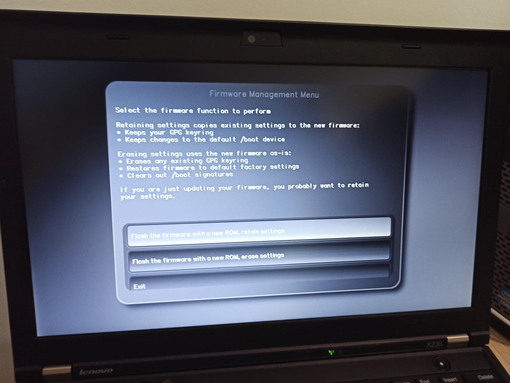
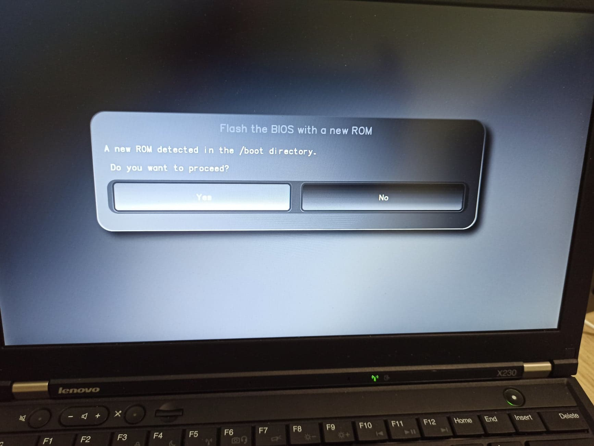
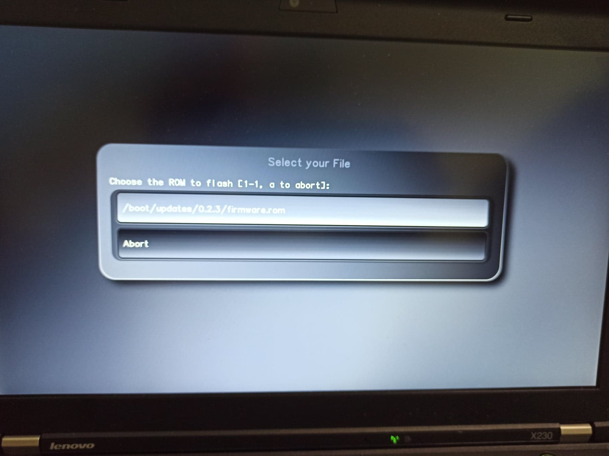
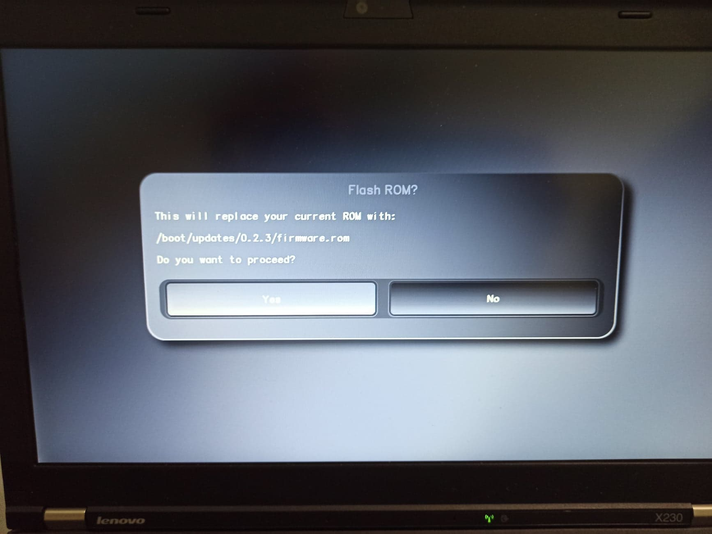
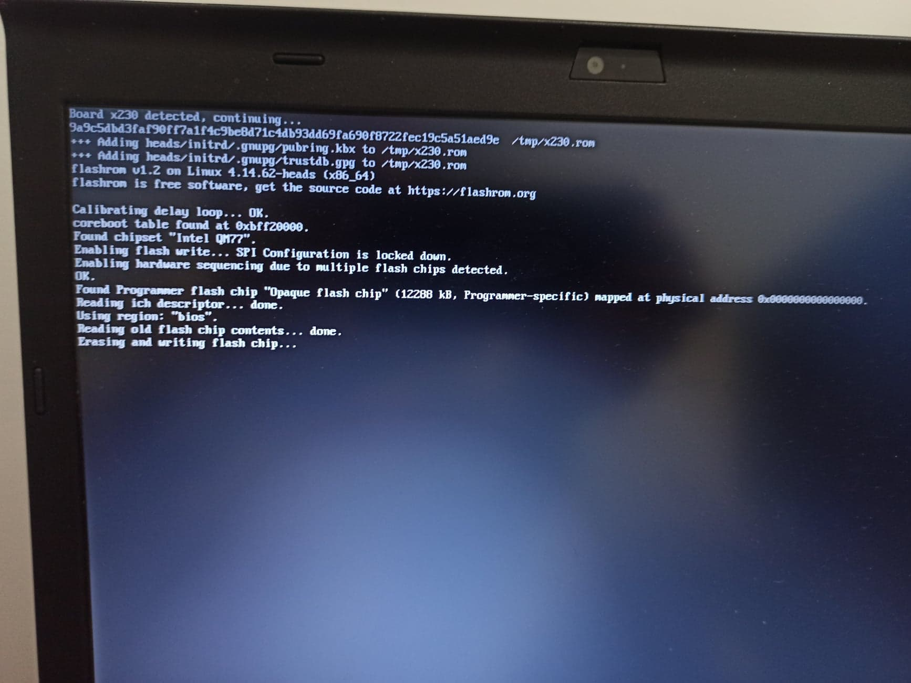
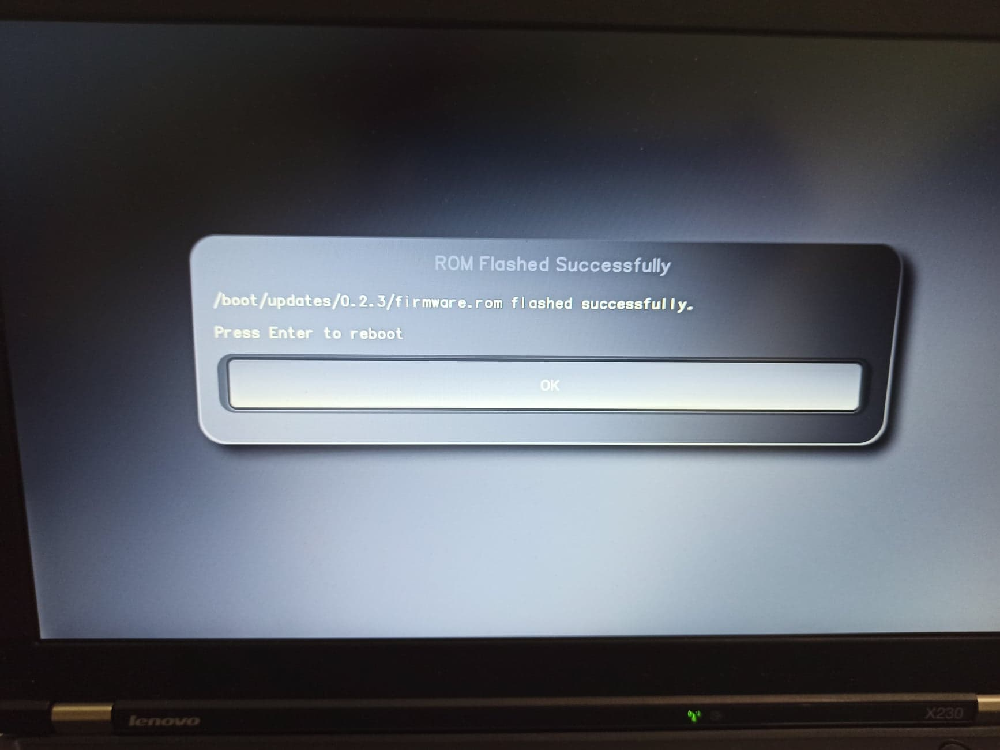

# Heads update

The Heads update was tested on the `Lenovo ThinkPad x230`.

## Requirements

You need to build and flash Heads ROM from the
[3mdeb fork](https://github.com/3mdeb/heads/tree/qubes-fwupd).
You will find there Heads ROMs for ThinkPad x230.

## Update process

ThinkPad x230 is now the only laptop that has Heads ROM in the custom LVFS
storage. Nevertheless, qubes-fwupd has already implemented a `device` flag, that
will allow updates for other hardware.

At first run the qubes-fwupd Heads update.

```
sudo qubes-fwupdmgr update-heads --device=x230
```

Press Y to reboot the device.

In the main menu, choose `options` and then go to `Flash/Update the BIOS`



Decide to retain or erase the settings.



The tool will inform you that heads update has been detected in `/boot`
directory. If you will decide not to update, you will be asked to attach the
USB drive.



Select a ROM file.



Press yes to confirm the choice. The Heads update will begin.




Wait until the end of the update process.



Press OK to reboot the system.



## Test

Change directory to `/usr/share/qubes-fwupd` and run test case with sudo
privileges.

### Qubes OS R4.1

```
# python3 -m unittest -v test.test_qubes_fwupd_heads
```
