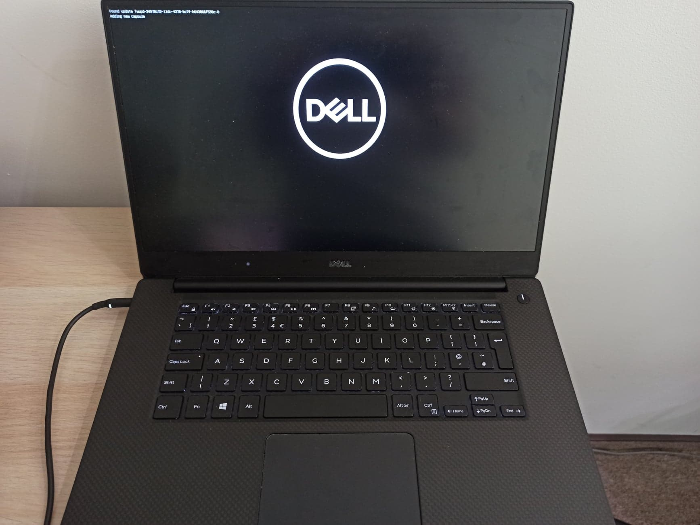
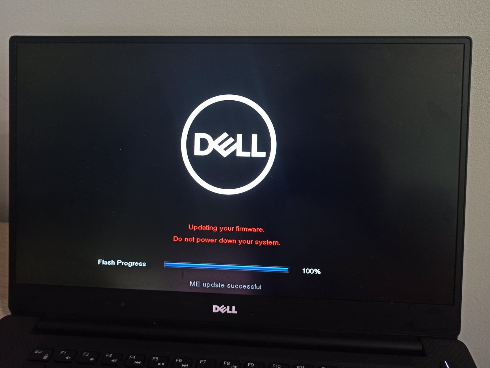
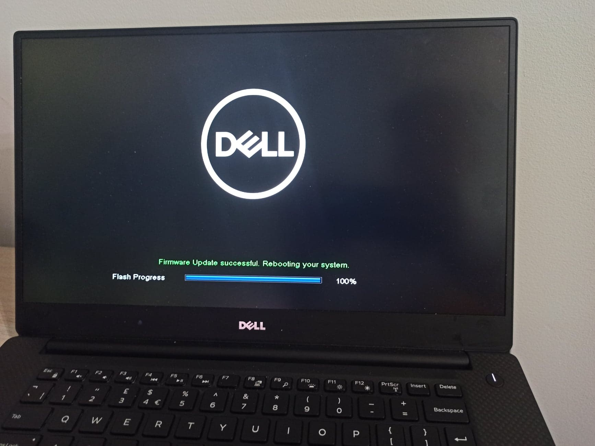

# UEFI capsule update

The qubes-fwupd handle the UEFI capsule update under several conditions.
The fwupd uses ESRT tables to read GUID, and that causes trouble when the OS
is running under a hypervisor. The Xen does not pass the ESRT tables to
paravirtualized dom0, so the Qubes is not able to provide sysfs information.
More information you can find it this thread:

https://patchwork.kernel.org/patch/11715901/

## Requirements

### Qubes OS

You need Qubes R4.1 to use the UEFI capsule update.

### Hardware

Make sure that your hardware has available firmware updates in the [LVFS](https://fwupd.org/)

## UEFI capsule update - downgrade

UEFI capsule updates and downgrades were tested on DELL XPS 15 9560.

```
$ sudo qubes-fwupdmgr downgrade
```

## UEFI capsule update - update

```
$ sudo qubes-fwupdmgr update
```

## Update process

### Capsule found



### ME updated



### Success


