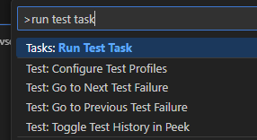
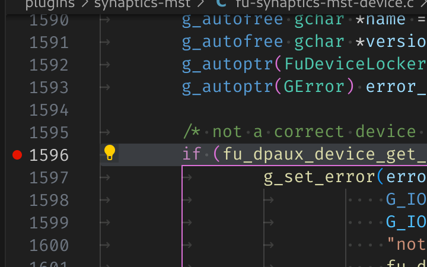
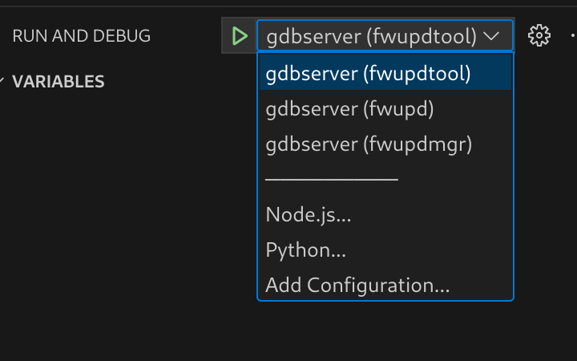
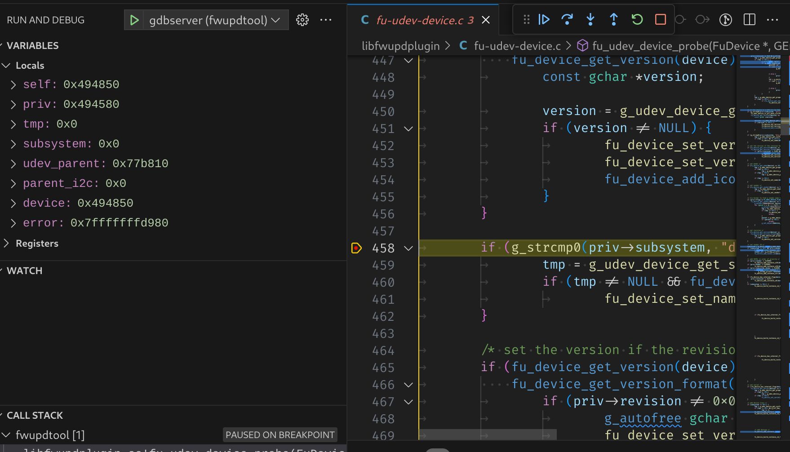
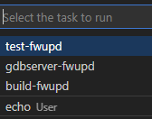

These instructons below can either be used by the silicon vendor, or the consulting company to debug existing and new plugins. Sometimes new hardware is only supported in the development version of fwupd which may not even be available as a Snap or Flatpak yet.

## Prerequisites

* A PC with Linux (preferably the latest version of Fedora) installed bare metal (i.e. not in VirtualBox or VMWare)

* Working access to the internet

* A user account (we’ll use `u` as the example here) with administrator permissions

## Setup fwupd development environment

A fwupd development environment is setup in a [virtualenv](https://virtualenv.pypa.io/en/latest/user_guide.html) to avoid development work for fwupd from conflicting with any system fwupd installation. All builds will occur in `venv/build` and all installs in `venv/dist`.
To set it up follow the below steps:

```shell
cd ~
git clone https://github.com/fwupd/fwupd.git
cd fwupd
./contrib/setup
```

## Building

After the development environment has been setup you can enter it by running:

```shell
source venv/bin/activate
```

You can tell you are in the development environment by looking at the start of your prompt for this prefix:

```text
(fwupd)
```

To build the project a script is included that will configure and build the project with default settings.

```shell
build-fwupd
```

To run the project test suite a script is included:

```shell
test-fwupd
```

If you want to leave the development environment at any time you can run:

```shell
deactivate
```

## Running binaries

The fwupd project is split into three main components:

1. **fwupd**: The binary that’s running in the background, as root

2. **fwupdmgr**: The client tool that end-users use to interact with the running `fwupd` binary, as a normal user

3. **fwupdtool**: The debugging tool developers use to find problems and to run new code, as root

The `fwupdtool` binary does most of the things that `fwupdmgr` does, but without talking to the system fwupd instance. It is a lot easier to run `fwupdtool` with just one plugin (e.g. `--plugins vli`) than running the daemon and all the plugins. You might have to wait 5 seconds and then read thousands of lines of debugging to see the `printf()` you added in a new plugin with the daemon, but with `fwupdtool --plugins vli --verbose get-devices` it’ll be in a few lines, and instant.

Within the development environment wrappers have been setup to allow launching `fwupd`, `fwupdtool` or `fwupdmgr` very similar to a host system.

There are 3 main differences to note:

1. The `systemd` service will not run.  That means that the daemon needs to be manually launched in the environment.
2. dbus *activation* doesn't work.  This mean that if you are testing the daemon (`fwupd`) and client (`fwupdmgr`) interaction you need to have two terminal tabs opened each in the development environment activated. One tab would run the daemon, and one would run the client.
3. `fwupd` and `fwupdtool` will be automatically started as root (IE with `sudo`).

With those differences in mind all 3 binaries can just be launched like normal:

```shell
fwupdtool get-devices
```

```shell
fwupd
```

```shell
fwupdmgr get-devices
```

## Using fwupdtool

To get the list of devices from one specific plugin I would do:

```shell
fwupdtool --plugins vli get-devices --verbose
```

This outputs lots of text onto the console like:

```text
10:51:49:0584 FuMain               Lenovo ThinkPad WS Dock
 DeviceId:             73ef80b60058b4f18549921520bfd94eaf18710a
 Guid:                 dd1f77bd-88ef-5293-9e34-1fe5ce187658 <- USB\VID_17EF&PID_305A&REV_5011
 Guid:                 1c09a12d-e58a-5b4d-84af-ee3eb4c3c68b <- USB\VID_17EF&PID_305A
 Guid:                 6201fecc-1641-51f6-a6d2-38a06d5476bf <- VLI_USBHUB\SPI_C220
 Guid:                 c9caa540-6e27-5d40-a322-47eaeef84df0 <- USB\VID_17EF&PID_305A&SPI_C220&REV_5011
 Guid:                 cfa1e12c-4eb9-5338-8b23-02acc5423ccb <- USB\VID_17EF&PID_305A&SPI_C220
 Summary:              USB 3.x Hub
 Plugin:               vli
 Protocol:             com.vli.usbhub
 Flags:                updatable|registered|can-verify|can-verify-image
 Vendor:               LENOVO
 VendorId:             USB:0x17EF
 Version:              50.11
 VersionFormat:        bcd
 Icon:                 audio-card
 InstallDuration:      10
 Created:              2019-12-20
```

Using fwupdtool raw firmware blob (i.e. not the cabinet archive with metadata) can be installed on the device using:

```shell
fwupdtool --verbose --plugins vli \
 install-blob /home/u/the-firmware.bin 73ef80b60058b4f18549921520bfd94eaf18710a
```

## Firmware Parsing

You can also parse the raw .bin files using `fwupdtool` which has access to all the available firmware parsers built into all plugins. For example:

```shell
fwupdtool firmware-parse /home/user/VL105_APP6_8C_09_08_06_20190815.bin
Choose a firmware type:
0. Cancel
1. conexant
2. 8bitdo
3. synaprom
4. rmi
5. wacom
6. vli-pd
7. raw
8. altos
9. srec
10. ihex
11. vli-usbhub
12. vli-usbhub-pd
12<enter>
FuVliUsbhubPdFirmware:
Version:                 140.9.8.6
ChipId:                  VL105
VID:                     0x2109
PID:                     0x105
 FuFirmwareImage:
 Data:                  0xc000
```

## Using fwupdmgr

You can perform the end-to-end tests with two terminals open to the fwupd development environment. In the first do:

```shell
fwupd --verbose
```

and in the second you can do:

```shell
fwupdmgr install ~/foo.cab
```

This will send the firmware archive from the locally built `fwupdmgr` to the locally built daemon using a file descriptor, which will call the new plugin code with the firmware blob in the archive. The daemon terminal will also show lots of useful debugging during this process.

## Using Visual Studio code to build and test

During build time a set of tasks will have been created for use with Visual Studio Code.

The default build task which is triggered by using *ctrl-shift-b* will build the project with default settings.
The default test task can be triggered from the command palette to run the test suite.
Open the command palette with *ctrl-shift-p* and type **Run test task** and hit enter. This will launch the daemon in a terminal window.


## Using Visual Studio Code to debug

The [debugger](https://code.visualstudio.com/Docs/editor/debugging) that is part of [Visual Studio Code](https://code.visualstudio.com/) is really helpful for debugging issues.
During build time a set of launch targets will have been created for use with Visual Studio Code.
All 3 binaries have the ability be launched with a debugger attached as a **user** by using `DEBUG=1` in the environment.

### debugging `fwupdtool` and `fwupdmgr`

For example to debug `fwupdtool` you would launch it like this:

```shell
(fwupd) u@fedora:~/fwupd$ DEBUG=1 fwupdtool get-devices
Process /home/u/fwupd/venv/bin/../dist/bin/fwupdtool created; pid = 595311
Listening on port 9091
```

This will configure `gdbserver` to listen on a local port waiting for a debugger to connect.

Launch vscode in the same directory as the Git checkout. After it's launched, set a source breakpoint.



Then use the run and debug button (or *ctrl-shift-d*) to open up the debugger. From the debugger choose the tool to use.



Press the green start button (or use *F5*) to start debugging. The debugger will attach to the process you launched and stop where you left off.



### debugging fwupd (daemon)

For debugging the daemon, a helper task is also included to launch the daemon with the `DEBUG` environment variable set within vscode.

Open the command palette with *ctrl-shift-p* and type **Run task** and hit enter. Select the `gdbserver-fwupd` task.
This will launch the daemon in a terminal window.


Then use the run and debug button (or *ctrl-shift-d*) to open up the debugger. From the debugger choose `gdbserver (fwupd)`.


