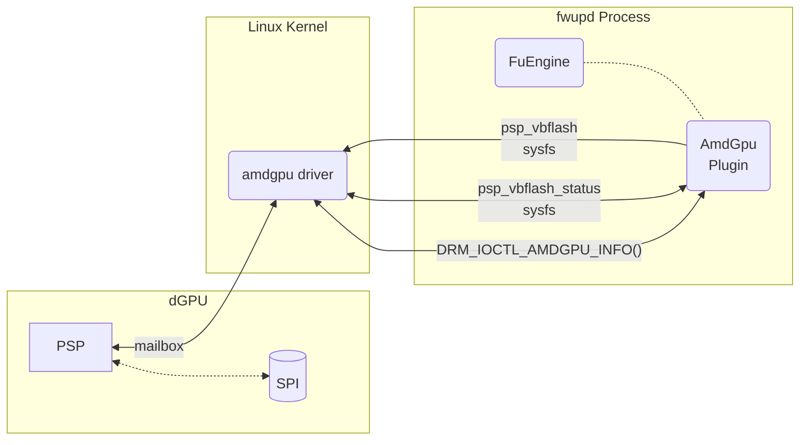

## Introduction

This plugin reports the vbios version of APU devices supported by amdgpu and supports
flashing the IFWI of some dGPU devices.

## External Interface Access

This plugin requires R/W access to sysfs files located within `/sys/bus/pci/drivers/*/amdgpu`.
This plugin requires ioctl access to `DRM_IOCTL_AMDGPU_INFO`.

## Firmware Format

This plugin supports the following protocol IDs:

* `com.amd.pspvbflash`
* `com.amd.pldm`

The plugin can also parse firmware update packages formatted as a PLDM firmware
update package, as defined by [DMTF DSP0267](https://www.dmtf.org/sites/default/files/standards/documents/DSP0267_1.0.1.pdf).
The package header is identified by the well-known UUID
`F018878C-CB7D-4943-9800-A02F059ACA02`; each component image within the package
is exposed as a child firmware image located at its `ComponentLocationOffset`.

On accelerators and dGPUs that expose the `remote_mgmt_fw` sysfs interface, a
separate remote-management device is created as the *parent* of the GPU device.
Its current version is read from the `pldm_fw_version` sysfs file, and it is
updated by writing a PLDM firmware bundle (protocol `com.amd.pldm`) to the
`remote_mgmt_fw` sysfs file and polling `remote_mgmt_fw_status` for completion.

## GUID Generation

The plugin will use standard PCI GUIDs, but also generate an AMD GPU specific GUID
with the part number: `AMD\$PART_NUMBER`

## Update behavior

The dGPU will boot into the new firmware when the system is rebooted.
The dGPU contains two partitions, and the update will be applied to the inactive
partition. If the active partition becomes corrupted for any reason the dGPU may
revert back to an older firmware present on the inactive partition.

## Version Considerations

This plugin has been available since fwupd version `1.8.11`.
Update functionality has been available since fwupd version `1.9.6`.

## Threat Model

The plugin runs within the privileged fwupd process.  The plugin doesn't directly
interface with the hardware, but rather interfaces with the kernel driver which
interfaces with the hardware.

