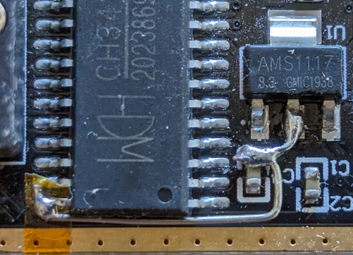

## Introduction

The CH341A is an affordable SPI programmer.

The assumed map between UIO command bits, pins on CH341A chip and pins on SPI chip:

    UIO  CH341A  SPI     CH341A
    0    D0/15   CS/1    CS0
    1    D1/16   unused  CS1
    2    D2/17   unused  CS2
    3    D3/18   SCK/6   DCK
    4    D4/19   unused  DOUT2
    5    D5/20   SI/5    DOUBT
    6    D6/21   unused  DIN2
    7    D7/22   SO/2    DIN

IMPORTANT NOTE:

You must perform the 3.3V signal output modification if you are using the CH341A with 3.3V SPI
chips. The CH341A has a design flaw that outputs 5V on the MISO and MOSI pins even when VCC is 3V
which will almost certainly be out-of-specification for the device you are trying to program.

See [this guide](https://www.chucknemeth.com/usb-devices/ch341a/3v-ch341a-mod) for more details.

## Firmware Format

The daemon will decompress the cabinet archive and extract a firmware blob of unspecified format.

This plugin supports the following protocol ID:

- `org.jedec.cfi`

## GUID Generation

These devices use the standard USB DeviceInstanceId values, e.g.

- `USB\VID_1A86&PID_5512&REV_0304`
- `USB\VID_1A86&PID_5512`

## Update Behavior

The device programs devices in raw mode, and can best be used with `fwupdtool`.

To write an image, use `sudo fwupdtool --plugins ch341a install-blob firmware.bin` and to backup
the contents of a SPI device use `sudo fwupdtool --plugins ch341a firmware-dump backup.bin`

## Vendor ID Security

The vendor ID is set from the USB vendor, in this instance set to `USB:0x1A86`

## External Interface Access

This plugin requires read/write access to `/dev/bus/usb`.

## Version Considerations

This plugin has been available since fwupd version `1.8.0`.
