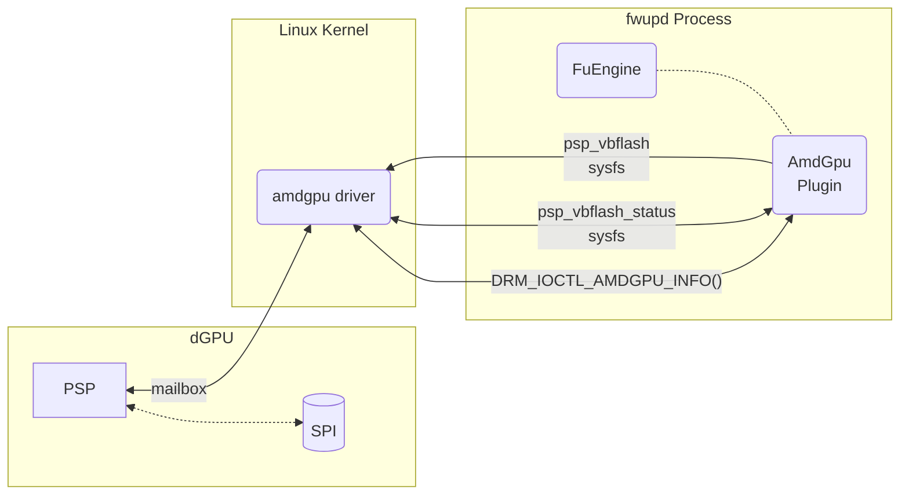

## Introduction

This plugin reports the vbios version of APU devices supported by amdgpu and supports
flashing the IFWI of some dGPU devices.

## External Interface Access

This plugin requires R/W access to sysfs files located within `/sys/bus/pci/drivers/*/amdgpu`.
This plugin requires ioctl access to `DRM_IOCTL_AMDGPU_INFO`.

## Firmware Format

This plugin supports the following protocol ID:

* `com.amd.pspvbflash`

## GUID Generation

The plugin will use standard PCI GUIDs, but also generate an AMD GPU specific GUID
with the part number: `AMD\$PART_NUMBER`

## Update behavior

The dGPU will boot into the new firmware when the system is rebooted.
The dGPU contains two partitions, and the update will be applied to the inactive
partition. If the active partition becomes corrupted for any reason the dGPU may
revert back to an older firmware present on the inactive partition.

## Version Considerations

This plugin has been available since fwupd version `1.8.11`.
Update functionality has been available since fwupd version `1.9.6`.

## Threat Model

The plugin runs within the privileged fwupd process.  The plugin doesn't directly
interface with the hardware, but rather interfaces with the kernel driver which
interfaces with the hardware.

## Owners

Anyone can submit a pull request to modify this plugin, but the following people should be
consulted before making major or functional changes:

* Mario Limonciello: @superm1
