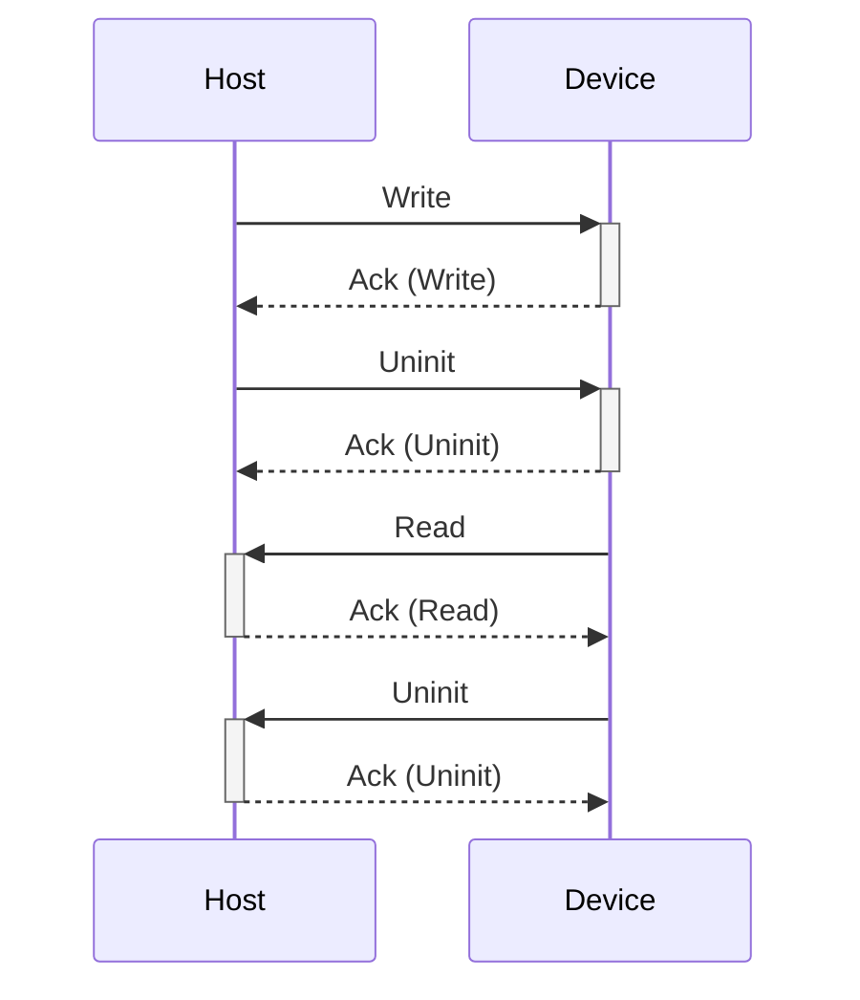
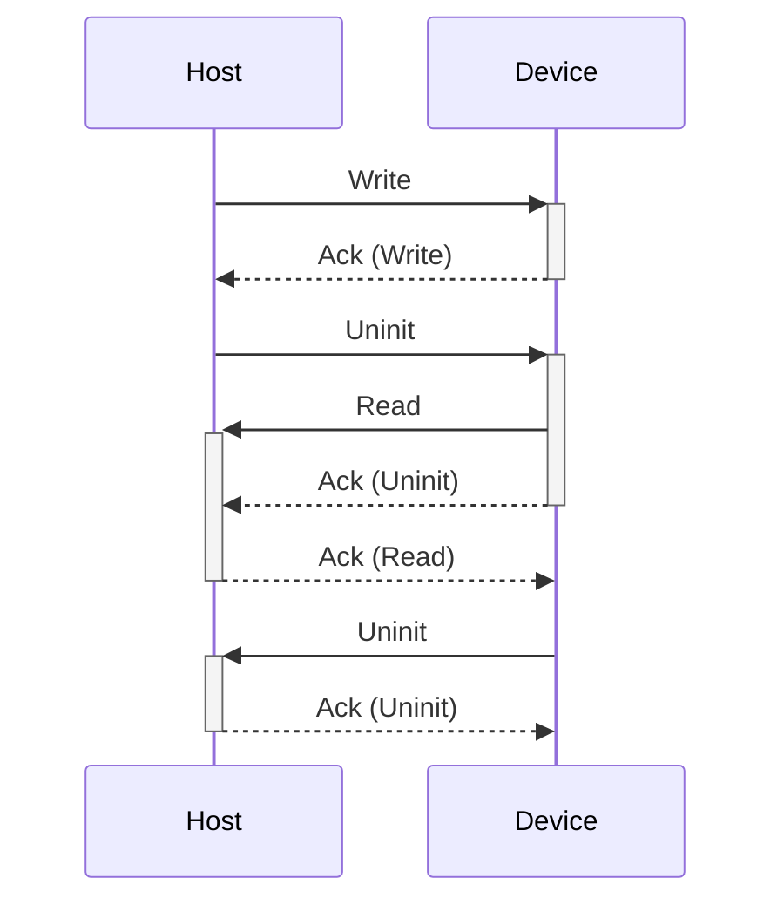

## Introduction

This plugin can upgrade the firmware on Logitech Video Collaboration products
(Rally Bar and RallyBar Mini), using USB bulk transfer.

## Firmware Format

The daemon will decompress the cabinet archive and extract a firmware blob in
a packed binary file format.

This plugin supports the following protocol ID:

* `com.logitech.vc.proto`

## GUID Generation

These devices use the standard USB DeviceInstanceId values, e.g.

* `USB\VID_046D&PID_089B`

## Quirk Use

This plugin uses the following plugin-specific quirks:

### `Flags=check-buffer-size`

Query the device at startup to see if we can use a larger buffer size.

Since: 1.9.7

## Update Behavior

The peripheral firmware is deployed when the device is in normal runtime mode,
and the device will reset when the new firmware has been written.

## Design Notes

There are two protocols in use, `LogitechBulkcontrollerSendSync` and `LogitechBulkcontrollerSendUpd`
which correspond to the two different bulk endpoints.

The "Sync" interface accepts protobuf-formatted binary data as described in `proto/`, encapsulated
further in a `LogitechBulkcontrollerSendSyncReq` and returned as a `LogitechBulkcontrollerSendSyncRes`.

The sequence IDs seem to be used to allow parallel queries, although in practice some of the IDs
are hardcoded to zero even when setting them in the request.

There seems to be two possible flows when writing using the bulk "Sync" interface:

or...

Additionally, the device seems to force re-enumeration at random times, presumably restarting due
to a protocol error or interface timeout.

## Vendor ID Security

The vendor ID is set from the USB vendor, in this instance set to `USB:0x046D`

## External Interface Access

This plugin requires read/write access to `/dev/bus/usb`.

## Version Considerations

This plugin has been available since fwupd version `1.7.0`.

## Owners

Anyone can submit a pull request to modify this plugin, but the following people should be
consulted before making major or functional changes:

* Sanjay Sheth: @vcdmp
